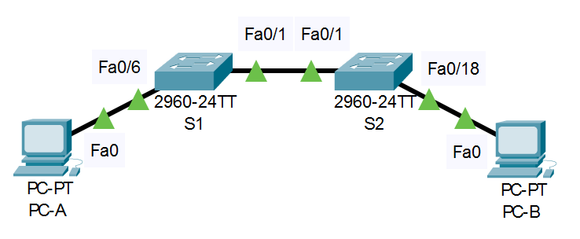
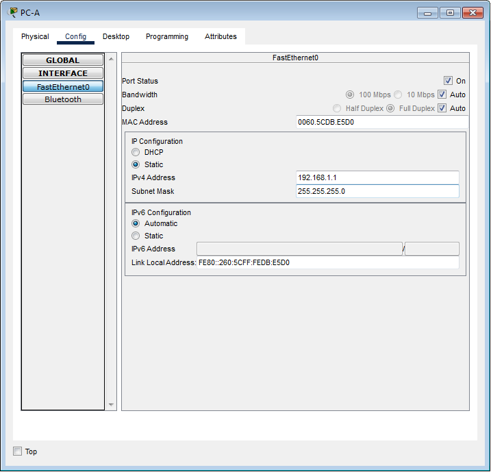
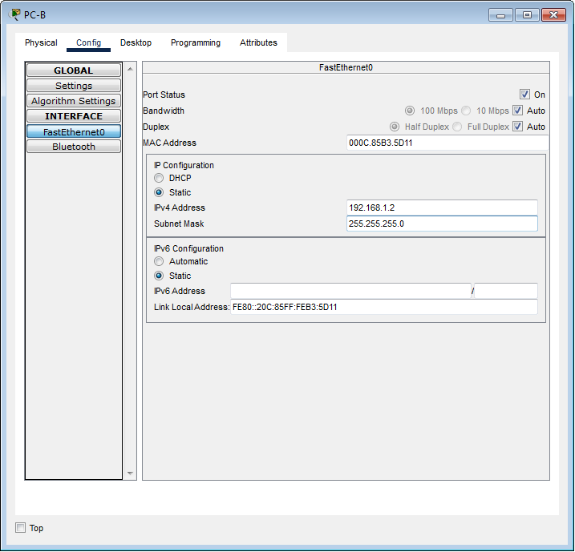

# Лабораторная работа 2. Просмотр таблицы MAC-адресов коммутатора 

# **Топология**


# **Таблица адресации**
|**Устройство**|**Интерфейс**|**IP-адрес**|**Маска подсети**|
| :-: | :-: | :-: | :-: |
|S1|VLAN 1|192.168.1.11|255.255.255.0|
|S2|VLAN 1|192.168.1.12|255.255.255.0|
|PC-A|NIC|192.168.1.1|255.255.255.0|
|PC-B|NIC|192.168.1.2|255.255.255.0|
# **Цели**
**Часть 1. Создание и настройка сети с заданной топологией и настройкой узлов**

**Часть 2. Изучение таблицы МАС-адресов коммутатора**

# **Общие сведения/сценарий**
Коммутатор локальной сети на уровне 2 предназначен для доставки кадров Ethernet всем узловым устройствам в локальной сети (LAN). Он записывает МАС-адреса узлов, отображаемые в сети, и сопоставляет их с собственными портами коммутатора Ethernet. Этот процесс называется созданием таблицы МАС-адресов. Получив кадр от ПК, коммутатор изучает МАС-адреса источника и назначения кадра. MAC-адрес источника регистрируется и сопоставляется с портом коммутатора, от которого он был получен. Затем по таблице MAC-адресов определяется МАС-адрес назначения. Если MAC-адрес назначения известен, кадр пересылается через соответствующий порт коммутатора, связанный с этим MAC-адресом. Если MAC-адрес неизвестен, то кадр отправляется по широковещательной рассылке через все порты коммутатора, кроме того, через который он был получен. Важно видеть и понимать работу коммутатора и то, как он осуществляет передачу данных по сети. Понимание функционала коммутатора особенно важно для сетевых администраторов, задача которых заключается в обеспечении безопасной и стабильной работы сети.

Коммутаторы используются для соединения компьютеров в локальных сетях (LAN) и передачи данных между ними. Коммутаторы отправляют кадры Ethernet на узловые устройства, которые идентифицируются по МАС-адресам сетевых плат.

В части 1 нам нужно построить топологию, состоящую из двух коммутаторов, соединенных транком. 
В части 2 нам предстоит отправить эхо-запросы различным устройствам и посмотреть, как два коммутатора строят свои таблицы МАС-адресов.

**Примечание.** В лабораторной работе используются коммутаторы Cisco Catalyst 2960s с операционной системой Cisco IOS 15.2(2) (образ lanbasek9). Допускается использование других моделей коммутаторов и других версий Cisco IOS. В зависимости от модели устройства и версии Cisco IOS доступные команды и результаты их выполнения могут отличаться от тех, которые показаны в лабораторных работах.

**Примечание**: Убедитесь, что все настройки коммутатора удалены и загрузочная конфигурация отсутствует. Если вы не уверены в этом, обратитесь к инструктору.
# **Необходимые ресурсы**
- 2 коммутатора (Cisco 2960 с операционной системой Cisco IOS 15.2(2) (образ lanbasek9) или аналогичная модель)
- 2 ПК (Windows и программа эмуляции терминала, такая как Tera Term)
- Консольные кабели для настройки устройств Cisco IOS через консольные порты.
- Кабели Ethernet, расположенные в соответствии с топологией

**Примечание.** Интерфейсы Fast Ethernet на коммутаторах Cisco 2960 определяют тип подключения автоматически, поэтому между коммутаторами S1 и S2 можно использовать прямой кабель Ethernet. При использовании коммутатора Cisco другой модели может потребоваться перекрестный кабель Ethernet.
# **Инструкции**

## Часть 1. **Создадим и настроим сеть, используя эмулятор Cisco Packet Tracer 8.1 и  руководствуясь данными**

   1. ### **Соединим на схеме заданные интерфейсы между собой. После некоторого промежутка времени видим, что сетевые интерфейсы устройств поднялись, т.е. линки стали активными**
   2. ### **Настроим сначала узлы ПК.**
 
 <details>
   
   <summary> Настройка NIC узла  PC-A </summary>
   
   
   
   </details>
   
 <details>
   
   <summary> Настройка NIC узла  PC-B </summary>
      
   
   
</details>
   
   
   3. ## **Выполним инициализацию и перезагрузку коммутаторов.**
для инициализации и перезагрузки коммутаторов выполним следующие команды в привелигированном режиме на каждом из них:

```
Switch> ena
Switch#erase startup-config
Switch#del vlan.dat  
Switch#reload
```
4. ## **Настроим последовательно базовые параметры каждого коммутатора.**
*Откроем  CLI конфигурации коммутаторов S1 и S2*

   1. Настроим имя  каждого коммутатора в соответствии с топологией.
   1. Настройте соответственно их IP-адреса, как указано в таблице адресации.
   1. Назначим **cisco** в качестве паролей консоли и VTY.
   1. Назначим **class** в качестве пароля доступа к привилегированному режиму EXEC.

<details>
   
   <summary> Настройка  коммутатора S1   </summary>
      
  ```
   
   Switch>ena
   Switch#config
   Switch(config)#hostname S1
   S1#(config)interface vlan 1
   S1#(config-if)ip address 192.168.1.11 255.255.255.0
   S1#(config-if)exit 
   S1(config)enable secret class
   S1(config)# line con 0
   S1(config-line)# password cisco
   S1(config-line)# login
   S1(config-line)# logging synchronous
   S1(config-line)# exit
   S1(config)#line vty 0-15
   S1(config-line)password cisco
   S1(config-line)login
   S1(config-line)exit
   S1(config)commit
   S1(config)exit
   S1#
   
   ```
   
</details>

<details>
   
   <summary> Настройка  коммутатора S2   </summary>
      
  ```
   
   Switch>ena
   Switch#config
   Switch(config)#hostname S2
   S2#(config)interface vlan 1
   S2#(config-if)ip address 192.168.1.12 255.255.255.0
   S2#(config-if)exit 
   S2(config)enable secret class
   S2(config)# line con 0
   S2(config-line)# password cisco
   S2(config-line)# login
   S2(config-line)# logging synchronous
   S2(config-line)# exit
   S2(config)#line vty 0-15
   S2(config-line)password cisco
   S2(config-line)login
   S2(config-line)exit
   S2(config)commit
   S2(config)exit
   S2#
   
   ```
   
</details>

*Закроем окна настроек коммутаторов.*

## Часть 2. **Изучение таблицы МАС-адресов коммутатора**
Как только между сетевыми устройствами начинается передача данных, коммутатор выясняет МАС-адреса и строит таблицу.

1. ### **Запишем МАС-адреса сетевых устройств.**
   a) Откройте командную строку на PC-A и PC-B и введите команду **ipconfig /all**.

*Откроем окно командной строки Windows, запустив соответствующее приложение:*  

___С:>\Windows\system32\cmd.exe___  

выполним данную команду сначала для PC-A, затем для PC-B. 

#### Вопрос:
Назовите физические адреса адаптера Ethernet?
### ___Ответ:___
- MAC-адрес компьютера PC-A: ----> ___00:60:5C:DB:E5:D0___ 

- MAC-адрес компьютера PC-B: ----> ___00:0C:85:B3:5D:11___

*Закроем окно командной строки.*

b) Теперь подключимся к коммутаторам S1 и S2 через консоль и введите команду **show interface F0/1** на каждом коммутаторе.

*Откроем окно конфигурации коммутатора S1 и введем указанную команду:

<details>
   
   <summary> результат выполнения команды на коммутаторе S1</summary>
      
   ```
   
   S1#sh int fa0/1
FastEthernet0/1 is up, line protocol is up (connected)
  Hardware is Lance, address is 0004.9ae7.9b01 (bia 0004.9ae7.9b01)
 BW 100000 Kbit, DLY 1000 usec,
     reliability 255/255, txload 1/255, rxload 1/255
  Encapsulation ARPA, loopback not set
  Keepalive set (10 sec)
  Full-duplex, 100Mb/s
  input flow-control is off, output flow-control is off
  ARP type: ARPA, ARP Timeout 04:00:00
  Last input 00:00:08, output 00:00:05, output hang never
  Last clearing of "show interface" counters never
  Input queue: 0/75/0/0 (size/max/drops/flushes); Total output drops: 0
  Queueing strategy: fifo
  Output queue :0/40 (size/max)
  5 minute input rate 0 bits/sec, 0 packets/sec
  5 minute output rate 0 bits/sec, 0 packets/sec
     956 packets input, 193351 bytes, 0 no buffer
     Received 956 broadcasts, 0 runts, 0 giants, 0 throttles
     0 input errors, 0 CRC, 0 frame, 0 overrun, 0 ignored, 0 abort
     0 watchdog, 0 multicast, 0 pause input
     0 input packets with dribble condition detected
     2357 packets output, 263570 bytes, 0 underruns
     0 output errors, 0 collisions, 10 interface resets
     0 babbles, 0 late collision, 0 deferred
     0 lost carrier, 0 no carrier
     0 output buffer failures, 0 output buffers swapped out
   ```
   
</details>

<details>
   
   <summary> результат выполнения команды на коммутаторе S2</summary>
      
   ```
S2#show interface fa0/1 
FastEthernet0/1 is up, line protocol is up (connected)
  Hardware is Lance, address is 00d0.9794.a801 (bia 00d0.9794.a801)
 BW 100000 Kbit, DLY 1000 usec,
     reliability 255/255, txload 1/255, rxload 1/255
  Encapsulation ARPA, loopback not set
  Keepalive set (10 sec)
  Full-duplex, 100Mb/s
  input flow-control is off, output flow-control is off
  ARP type: ARPA, ARP Timeout 04:00:00
  Last input 00:00:08, output 00:00:05, output hang never
  Last clearing of "show interface" counters never
  Input queue: 0/75/0/0 (size/max/drops/flushes); Total output drops: 0
  Queueing strategy: fifo
  Output queue :0/40 (size/max)
  5 minute input rate 0 bits/sec, 0 packets/sec
  5 minute output rate 0 bits/sec, 0 packets/sec
     956 packets input, 193351 bytes, 0 no buffer
     Received 956 broadcasts, 0 runts, 0 giants, 0 throttles
     0 input errors, 0 CRC, 0 frame, 0 overrun, 0 ignored, 0 abort
     0 watchdog, 0 multicast, 0 pause input
     0 input packets with dribble condition detected
     2357 packets output, 263570 bytes, 0 underruns
     0 output errors, 0 collisions, 10 interface resets
     0 babbles, 0 late collision, 0 deferred
     0 lost carrier, 0 no carrier
     0 output buffer failures, 0 output buffers swapped out
   ```
   
</details>

#### Вопросы:
Назовите адреса оборудования во второй строке выходных данных команды (или зашитый адрес — bia).

МАС-адрес коммутатора S1 Fast Ethernet 0/1: ---->___0004.9ae7.9b01___

МАС-адрес коммутатора S2 Fast Ethernet 0/1: ---->___00d0.9794.a801___

*Закроем окно настройки.*

2. ### **Посмотрим таблицу МАС-адресов коммутатора.**
Подключитесь к коммутатору S2 через консоль и просмотрите таблицу МАС-адресов до и после тестирования сетевой связи с помощью эхо-запросов.

a) Подключимся к коммутатору S2 через консоль и войдем в привилегированный режим EXEC.

b) В привилегированном режиме EXEC введем команду **show mac address-table** и нажмите клавишу ввода.

S2# **show mac address-table**

<details>
   
   <summary> Результат выполнения команды </summary>
   
  ```
   
   S2#sh mac address-table 
          Mac Address Table
-------------------------------------------

Vlan    Mac Address       Type        Ports
----    -----------       --------    -----

   1    0004.9ae7.9b01    DYNAMIC     Fa0/1
     
  ```
      
</details>


#### Здесь мы пока наблюдаем только 1 сетевой  адрес во Vlan1 на интерфейсах Fa0/1 

Даже если сетевая коммуникация в сети не происходила (т. е. если команда ping не отправлялась), коммутатор может узнать МАС-адреса при подключении к ПК и другим коммутаторам, в режиме так называемого прослушивания или изучения МАС адресов на порту.

#### Вопросы:

1) Записаны ли в таблице МАС-адресов какие-либо МАС-адреса? 

#### ___Ответ:___

- ___Да___

2) Какие МАС-адреса записаны в таблице? С какими портами коммутатора они сопоставлены и каким устройствам принадлежат? Игнорируйте МАС-адреса, сопоставленные с центральным процессором. ---> 

#### ___Ответ:___

- ___В таблице коммутации записан 1 МАС адрес, полученный от устройства непосредственно подключенного к коммутатору S2 - это МАС адрес коммутатора S1 на интерфейсе Fa0/1.___

Если вы не записали МАС-адреса сетевых устройств в шаге 1, как можно определить, каким устройствам принадлежат МАС-адреса, используя только выходные данные команды **show mac address-table**? Работает ли это решение в любой ситуации? 

#### ___Ответ:___

- ___Да, по МАС можно определить производителя (вендора устройства) и понять, что за устройство подключено к тому или иному интерфейсу, однако МАС адреса не всегда могут появиться в таблице коммутации из-за неправильных настроек согласования порта, Vlan и т.д. интерфейсов устройств как со одной стороны, так и с другой стороны.___
 
 ### 3. **Очистим таблицу МАС-адресов коммутатора S2 и снова отобразите таблицу МАС-адресов.**

   a) В привилегированном режиме EXEC введите команду **clear mac address-table dynamic** и нажмите клавишу **Enter**.

S2# **clear mac address-table dynamic**

После ввода данной команды и повторного вывода списка таблицы коммутации видим, что таблица очистилась:

```
S2#sh mac address-table 
          Mac Address Table
-------------------------------------------

Vlan    Mac Address       Type        Ports
----    -----------       --------    -----

```

  b) Снова быстро введем команду **show mac address-table**.

Видим, что результат не изменился и мы снова видим  пустую таблицу коммутации свитча S2:

```
S2#sh mac address-table 
          Mac Address Table
-------------------------------------------

Vlan    Mac Address       Type        Ports
----    -----------       --------    -----
    
 ```  

#### Вопросы:
Указаны ли в таблице МАС-адресов адреса для VLAN 1? Указаны ли другие МАС-адреса?
- ___Нет  и другие МАС адреса не указаны.___

Через 10 секунд введем команду **show mac address-table** и нажмите клавишу ввода.

```
   
   S2#sh mac address-table 
          Mac Address Table
-------------------------------------------

Vlan    Mac Address       Type        Ports
----    -----------       --------    -----

   1    0004.9ae7.9b01    DYNAMIC     Fa0/1
     
  ```
Появились ли в таблице МАС-адресов новые адреса?

-___Да, мы снова можем наблюдать мас-адрес свитча S1 во VLAN 1 на интерфейсе Fa0/1  по истечении некоторого времени, поскольку интерфейсы свитчей могут обмениваться служебной информацией и находятся в рижиме изучения.___
 
### 4. **С компьютера PC-B отправьте эхо-запросы устройствам в сети и просмотрите таблицу МАС-адресов коммутатора.**

Выполним в командной строке компьютера соответствующую  команду и пропингуем ближайший коммутатор, т.е свитч S2:

___C:>ping 192.168.1.12___

И посмотрим сначала ARP-таблицу на PC-B:

___C:\>arp -a___

```
Internet Address      Physical Address      Type
192.168.1.12          0004.9aab.8cdd        dynamic

```
В результате видим, что в списке появился IP и МАС адреса коммутатора S2, где  также обновим и проверим информацию об МАС адресах:

```
S2#sh mac address-table 
          Mac Address Table
-------------------------------------------

Vlan    Mac Address       Type        Ports
----    -----------       --------    -----

   1    0004.9ae7.9b01    DYNAMIC     Fa0/1
   1    000c.85b3.5d11    DYNAMIC     Fa0/18

```
Видим, что в таблицу коммутации свитча S2 добавился мас-адрес PC-B, которая как раз возникла в результатете работы ARP протокола.

   a) На компьютере PC-B откройте командную строку и еще раз введите команду **arp -a**.

*Откройте командную строку.*

#### Вопрос:
Не считая адресов многоадресной и широковещательной рассылки, сколько пар IP- и МАС-адресов устройств было получено через протокол ARP?

b) Из командной строки PC-B отправьте эхо-запросы на компьютер PC-A, а также коммутаторы S1 и S2.
#### Вопрос:
От всех ли устройств получены ответы? Если нет, проверьте кабели и IP-конфигурации.

*Закройте командную строку.*

c) Подключившись через консоль к коммутатору S2, введите команду **show mac address-table**.

*Откройте окно конфигурации*
#### Вопрос:
Добавил ли коммутатор в таблицу МАС-адресов дополнительные МАС-адреса? Если да, то какие адреса и устройства?

На компьютере PC-B откройте командную строку и еще раз введите команду **arp -a**.
#### Вопрос:
Появились ли в ARP-кэше компьютера PC-B дополнительные записи для всех сетевых устройств, которым были отправлены эхо-запросы?

*Закройте командную строку.*
# **Вопрос для повторения**
В сетях Ethernet данные передаются на устройства по соответствующим МАС-адресам. Для этого коммутаторы и компьютеры динамически создают ARP-кэш и таблицы МАС-адресов. Если компьютеров в сети немного, эта процедура выглядит достаточно простой. Какие сложности могут возникнуть в крупных сетях? 

#### Ответ: 
- ___В крупных сетях из-за большого количества узлов и соответственно повышенного широковещательного трафика может снижаться пропускная способность локальных сетей. Поэтому при количестве узлов больше чем 300 в одном широковещательном домене целезобразнее разбивать большие сети на более маленькие и переводить их во вланы (Vlan), чтобы не только снизить широковещательный трафик,  но также изолировать пользовательский трафик между собой тем самым повысить не только производительность сети, но и и ее безопасность.___
