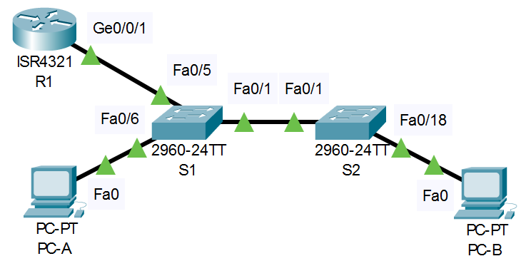

**Лабораторная работа 4 - Конфигурация безопасности коммутатора** 

# **Топология**

# **Таблица адресации**


|**Устройство**|**interface/vlan**|**IP-адрес**|**Маска подсети**|
| :-: | :-: | :-: | :-: |
|R1|G0/0/1|192.168.10.1|255.255.255.0|
|*R1*|Loopback 0 |10.10.1.1|255.255.255.0|
|S1|VLAN 10|192.168.10.201|255.255.255.0|
|S2|VLAN 10|192.168.10.202|255.255.255.0|
|PC A|NIC|DHCP|255.255.255.0|
|PC B|NIC|DHCP|255.255.255.0|
# **Цели**
**Часть 1. Настройка основного сетевого устройства**

- Создайте сеть.
- Настройте маршрутизатор R1.
- Настройка и проверка основных параметров коммутатора

**Часть 2. Настройка сетей VLAN**

- Сконфигруриуйте VLAN 10.
- Сконфигруриуйте SVI для VLAN 10.
- Настройте VLAN 333 с именем Native на S1 и S2.
- Настройте VLAN 999 с именем ParkingLot на S1 и S2.

**Часть 3: Настройки безопасности коммутатора.**

- Реализация магистральных соединений 802.1Q.
- Настройка портов доступа
- Безопасность неиспользуемых портов коммутатора
- Документирование и реализация функций безопасности порта.
- Реализовать безопасность DHCP snooping .
- Реализация PortFast и BPDU Guard
- Проверка сквозной связанности.
  # **Общие сведения и сценарий**
Это комплексная лабораторная работа, нацеленная на повторение ранее изученных функций безопасности уровня 2.

**Примечание**: Маршрутизаторы, используемые в практических лабораторных работах CCNA, - это Cisco 4221 с Cisco IOS XE Release 16.9.3 (образ universalk9). В лабораторных работах используются коммутаторы Cisco Catalyst 2960 с Cisco IOS версии 15.0(2) (образ lanbasek9). Можно использовать другие маршрутизаторы, коммутаторы и версии Cisco IOS. В зависимости от модели устройства и версии Cisco IOS доступные команды и результаты их выполнения могут отличаться от тех, которые показаны в лабораторных работах. Правильные идентификаторы интерфейса см. в сводной таблице по интерфейсам маршрутизаторов в конце лабораторной работы.

**Примечание**: Убедитесь, что все настройки коммутатора удалены и загрузочная конфигурация отсутствует. Если вы не уверены, обратитесь к инструктору.
# **Необходимые ресурсы**
- 1 Маршрутизатор (Cisco 4221 с универсальным образом Cisco IOS XE версии 16.9.3 или аналогичным)
- 2 коммутатора (Cisco 2960 с операционной системой Cisco IOS 15.0(2) (образ lanbasek9) или аналогичная модель)
- 2 ПК (ОС Windows с программой эмуляции терминалов, такой как Tera Term)
- Консольные кабели для настройки устройств Cisco IOS через консольные порты.
- Кабели Ethernet, расположенные в соответствии с топологией
  # **Инструкции**
## Часть 1. **Настроим основные сетевые устройства**
### Шаг 1 **Создание сети.**
a) Создадим сеть согласно топологии, используя эмулятор Cisco Packet Tracer 8.1





b) проинициализируем данные устройства


### Шаг 2 **Настроим маршрутизатор R1.**
      
 a) Загрузим следующий конфигурационный скрипт на R1.

***Откроем окно конфигурации и скопируем данный набор команд:***

<details>
  
<summary> Config для роутера R1 </summary>
  
```
  
enable

configure terminal

hostname R1

no ip domain lookup

ip dhcp excluded-address 192.168.10.1 192.168.10.9

ip dhcp excluded-address 192.168.10.201 192.168.10.202

!

ip dhcp pool Students

network 192.168.10.0 255.255.255.0

default-router 192.168.10.1

domain-name CCNA2.Lab-11.6.1

!

interface Loopback0

ip address 10.10.1.1 255.255.255.0

!

interface GigabitEthernet0/0/1

description Link to S1

ip dhcp relay information trusted

ip address 192.168.10.1 255.255.255.0

no shutdown

!

line con 0

logging synchronous

exec-timeout 0 0
  
  
```
 
</details>


b) Проверим текущую конфигурацию на R1, используя следующую команду:

R1# **show ip interface brief**

<details>
  <summary> Список активных интерфейсов роутера R1:</summary>  

```
R1#sh ip interface brief
Interface              IP-Address      OK? Method Status                Protocol 
GigabitEthernet0/0/0   unassigned      YES unset  up                    down 
GigabitEthernet0/0/1   192.168.10.1    YES manual up                    up 
Loopback0              10.10.1.1       YES manual up                    up 
Vlan1                  unassigned      YES unset  administratively down down
```
</details>  
  
Видим, что интерфейс Vlan 1 отключен административно, включим его соответствующей командой и повторно выведем список интерфейсов:

<details>
  <summary> Включение Vlan 1 на роутере R1:</summary>  

```
R1#config t
R1#(config)int vlan 1
R1#(config-if)no shutdown
R1#(config-if)end
```
</details> 
  
R1# **show ip interface brief**

c) Убедимся, что IP-адресация и интерфейсы находятся в состоянии up / up (при необходимости устраните неполадки).

R1# **show ip interface brief**

```
R1#sh ip interface brief
Interface              IP-Address      OK? Method Status                Protocol 
GigabitEthernet0/0/0   unassigned      YES unset  up                    down 
GigabitEthernet0/0/1   192.168.10.1    YES manual up                    up 
Loopback0              10.10.1.1       YES manual up                    up 
Vlan1                  unassigned      YES unset  up                    down
```
Наблюдаем, что теперь все необходимые интерфейсы подняты и можно приступать к настройкам коммутаторов.

*Закроем окно настройки роутера R1.*

### Шаг 3 **Настройка и проверка основных параметров коммутатора**
   
   1. Настроим имя хоста для коммутаторов S1 и S2.

<details>
  <summary> Настройка имен свитчей S1 и S2:</summary>
  
Сначала откроем окно CLI для S1: 
```
Switch# config t

Switch(config)# hostname S1
```

Затем сделаем то же самое для S2:
```
Switch# config t

Switch(config)# hostname S2
```
</details>  

2. Запретим нежелательный поиск в DNS.

<details>
  <summary> Выключение нежелательного поиска в DNS для S1 и S2:</summary>
  
```
S1(config)# no ip domain-lookup

S2(config)# no ip domain-lookup
```
</details>  
  
3. Настроим описания интерфейса для портов, которые используются в S1 и S2:

<details>
  <summary> Настройка описаний интерфейсов для S1 и S2:</summary>
  
```
S1(config)# interface fa0/1

S1(config-if)# description Link to S2

S1(config–if)# interface fa0/5

S1(config-if)# description Link to R1

S1(config–if)# interface fa0/6

S1(config-if)# description Link to PC-A

 

S2(config)# interface fa0/1

S2(config-if)# description Link to S1

S2(config–if)# interface fa0/18

S2(config-if)# description Link to PC-B
```
</details>
 
4. Назначим шлюз по умолчанию для S1 и S2: 
  
  <details>
 <summary> Назначение шлюза по умолчанию для S1 и S2:</summary>
  
```
S1(config)# ip default-gateway 192.168.10.1

S2(config)# ip default-gateway 192.168.10.1
```
</details>
  
## Часть 2 **Настройка сетей VLAN на коммутаторах.**
 ### Шаг 1 **Сконфигруриуйте VLAN 10.**
Добавьте VLAN 10 на S1 и S2 и назовите VLAN - **Management.**
<details>
  <summary> Настройка описаний интерфейсов для S1 и S2:</summary>

```

S1(config)# vlan 10

S1(config-vlan)# name Management

-----------------------------------

S2(config)# vlan 10

S2(config-vlan)# name Management
```
  </details>
  

### Шаг 2 **Сконфигурируем SVI для VLAN 10.**
Настройте IP-адрес в соответствии с таблицей адресации для SVI для VLAN 10 на S1 и S2. Включите интерфейсы SVI и предоставьте описание для интерфейса.

  <details>
  <summary> Настройка IP интерфейсов SVI c описанием для S1 и S2:</summary>
  
    
```
S1(config)# interface vlan 10

S1(config-if)# ip address 192.168.10.201 255.255.255.0

S1(config-if)# description Management SVI

S1(config-if)# no shutdown

-------------------------------- 

S2(config)# interface vlan 10

S2(config-if)# ip address 192.168.10.202 255.255.255.0

2S1(config-if)# description Management SVI

S2(config-if)# no shutdown
```
  
  </details>
  
### Шаг 3. **Настройте VLAN 333 с именем Native на S1 и S2.**

  <details>
  <summary> Настройка Vlan 333  для S1 и S2:</summary>
  

```
S1(config)# vlan 333

S1(config-vlan)# name Native

-------------------------------- 

S2(config)# vlan 333

S2(config-vlan)# name Native
```

 </details>
    
### Шаг 4 **Настроим VLAN 999 с именем ParkingLot на S1 и S2.**

  <details>
  <summary> Настройка Vlan 999  для S1 и S2:</summary>
        
``` 
S1(config-vlan)# vlan 999

S1(config-vlan)# name ParkingLot

------------------------------------------

S2(config-vlan)# vlan 999

S2(config-vlan)# name ParkingLot
```
  
</details>

## Часть 3. **Настройки безопасности коммутатора.**
   ### Шаг 1. **Релизация магистральных соединений 802.1Q.**

a). Настроим все магистральные порты Fa0/1 на обоих коммутаторах для использования VLAN 333 в качестве native VLAN.
      
<details>
  
  <summary> Настройка безопасности магистральных портов на S1 и S2: </summary>
    
```
S1(config)# interface f0/1

S1(config-if)# switchport mode trunk

S1(config-if)# switchport trunk native vlan 333

--------------------------------------------- 

S2(config)# interface f0/1

S2(config-if)# switchport mode trunk

S2(config-if)# switchport trunk native vlan 333
 
```
  
</details>
    
    
b. Убедимся, что режим транкинга успешно настроен на всех коммутаторах.

<details>
  
  <summary> Проверка состояния безопасности магистральных портов на S1 и S2: </summary>

```
S1# show interface trunk

Port Mode Encapsulation Status Native vlan

Fa0/1 on 802.1q trunking 333

Port Vlans allowed on trunk

Fa0/1 1-4094

Port Vlans allowed and active in management domain

Fa0/1 1,10,333,999

Port Vlans in spanning tree forwarding state and not pruned

Fa0/1 1,10,333,999
  
-------------------------------------------------------------
  
S2# **show interface trunk**

Port Mode Encapsulation Status Native vlan

Fa0/1 on 802.1q trunking 333

Port Vlans allowed on trunk

Fa0/1 1-4094

Port Vlans allowed and active in management domain

Fa0/1 1,10,333,999

Port Vlans in spanning tree forwarding state and not pruned

Fa0/1 1,10,333,999
  
```
   </details>

c. Отключим согласование DTP Fa0/1 на S1 и S2. 

<details>
  
  <summary> отключение согласования магистральных портов на S1 и S2: </summary>

```
S1(config)# interface fa0/1

S1(config-if)# switchport nonegotiate

--------------------------------------------- 

S2(config)# interface f0/1

S2(config-if)# switchport nonegotiate
  
```
  
  </details>
  
d. Проверим настроенную функцию с помощью команды **show interfaces**:

<details>
  
  <summary>  Просмотр состояния магистральных портов на S1 и S2 в разрезе согласования: </summary>
  
```
S1# show interfaces fa0/1 switchport | include Negotiation

Negotiation of Trunking: Off
  
-----------------------------------------------------------------------  

S2# show interfaces fa0/1 switchport | include Negotiation

Negotiation of Trunking: Off
```
  
  </details>
  
### Шаг 2.**Настройка портов доступа**

  a) На S1 настроим Fa0/5 и Fa0/6 в качестве портов доступа и свяжем их с VLAN 10.
  
  <details>
  <summary>  Настройка безопасности портов доступа на S1: </summary>
   
   ```
   S1(config)# interface range fa0/5 – 6

   S1(config-if)# switchport mode access

   S1(config-if)# switchport access vlan 10
  
   ```
  
   </details>
  
   b) На S2 аналогично настроим порт доступа Fa0/18 и свяжем его с VLAN 10.
   
   <details>
  
   <summary>  Настройка безопасности порта на S2: </summary>
   
   ```
   S2(config)# interface fa0/18

   S2(config-if)# switchport mode access

   S2(config-if)# switchport access vlan 10 
   ```
  
  </details>
  
### Шаг 3. **Безопасность неиспользуемых портов коммутатора**

   a) На S1 и S2 переместим неиспользуемые порты из VLAN 1 в VLAN 999 и отключим их.
   
   
   <details>
  
   <summary>  Настройка безопасности неиспользуемых портов на S1 и S2: </summary>
  
      
   ```
   S1(config)# interface range f0/2-4 , fa0/7-24, gi0/1-2

   S1(config-if-range)# switchport mode access

   S1(config-if-range)# switchport access vlan 999

   S1(config-if-range)# shutdown

   --------------------------------------------------------- 

   S2(config)# interface range fa0/2-17 , fa0/19-24, gi0/1-2

   S2(config-if-range)# switchport mode access

   S2(config-if-range)# switchport access vlan 999

   S2(config-if-range)# shutdown
   ```
  
  </details>
  
  
   b) Убедимся, что неиспользуемые порты отключены и связаны с VLAN 999:
   
         
   S1# **show interfaces status**
   
   <details>
   
   <summary>  Настройка безопасности неиспользуемых портов на S1 и S2: </summary>
  
      
   ```
   S1# show interfaces status

   Port Name Status Vlan Duplex Speed Type

   Fa0/1 Link to S2 connected trunk a-full a-100 10/100BaseTX

   Fa0/2 disabled 999 auto auto 10/100BaseTX

   Fa0/3 disabled 999 auto auto 10/100BaseTX

   Fa0/4 disabled 999 auto auto 10/100BaseTX

   Fa0/5 Link to R1 connected 10 a-full a-100 10/100BaseTX

   Fa0/6 Link to PC-A connected 10 a-full a-100 10/100BaseTX

   Fa0/7 disabled 999 auto auto 10/100BaseTX

   Fa0/8 disabled 999 auto auto 10/100BaseTX

   Fa0/9 disabled 999 auto auto 10/100BaseTX

   Fa0/10 disabled 999 auto auto 10/100BaseTX

   <output omitted>
   
   -----------------------------------------------------------

   S2# show interfaces status

   Port Name Status Vlan Duplex Speed Type

   Fa0/1 Link to S1 connected trunk a-full a-100 10/100BaseTX

   Fa0/2 disabled 999 auto auto 10/100BaseTX

   Fa0/3 disabled 999 auto auto 10/100BaseTX

   <output omitted>

   Fa0/14 disabled 999 auto auto 10/100BaseTX

   Fa0/15 disabled 999 auto auto 10/100BaseTX

   Fa0/16 disabled 999 auto auto 10/100BaseTX

   Fa0/17 disabled 999 auto auto 10/100BaseTX

   Fa0/18 Link to PC-B connected 10 a-full a-100 10/100BaseTX

   Fa0/19 disabled 999 auto auto 10/100BaseTX

   Fa0/20 disabled 999 auto auto 10/100BaseTX

   Fa0/21 disabled 999 auto auto 10/100BaseTX

   Fa0/22 disabled 999 auto auto 10/100BaseTX

   Fa0/23 disabled 999 auto auto 10/100BaseTX

   Fa0/24 disabled 999 auto auto 10/100BaseTX

   Gi0/1 disabled 999 auto auto 10/100/1000BaseTX

   Gi0/2 disabled 999 auto auto 10/100/1000BaseTX
   ```
     
  </details> 
  

  ### Шаг 4. Документирование и реализация функций безопасности порта.
     

Интерфейсы F0/6 на S1 и F0/18 на S2 настроены как порты доступа. На этом шаге мы можем настроить их безопасность.
     
     
a) На S1, введeм команду **show port-security interface f0/6**  для отображения настроек по умолчанию безопасности порта для интерфейса F0/6  и запишем свои ответы ниже в таблицу:
     
<details>
  <summary> Вывод настроек безопасности порта Fa0/6 по умолчанию: </summary>
 
```    
S1# show port-security interface f0/6

Port Security              : Disabled

Port Status                : Secure-down

Violation Mode             : Shutdown

Aging Time                 : 0 mins

Aging Type                 : Absolute

SecureStatic Address Aging : Disabled

Maximum MAC Addresses      : 1

Total MAC Addresses        : 0

Configured MAC Addresses   : 0

Sticky MAC Addresses       : 0

Last Source Address:Vlan   : 0000.0000.0000:0

Security Violation Count   : 0
```    

</details>
     
     
**Конфигурация безопасности порта по умолчанию**
 
|**Функция**|**Настройка по умолчанию**|
|:-:|:-:|
|Защита портов|**Disabled**|
|Максимальное количество записей MAC-адресов|**1**|
|Режим проверки на нарушение безопасности|**Shutdown**|
|Aging Time|**0**|
|Aging Type|**Absolute**|
|Secure Static Address Aging|**Disabled**|
|Sticky MAC Address|**0**|
   
b) На S1 включим защиту порта на Fa0/6 со следующими настройками:
     
- Максимальное количество записей MAC-адресов: **3**
- Режим безопасности: **restrict**
- Aging time: **60 мин.**
- Aging type: **неактивный**
     
<details>
  <summary> Включение режима безопасности и задание настроек безопасности для Fa0/6 на S1:</summary>
  
     
```
S1(config)# interface f0/18

S1(config-if)# switchport port-security aging time 60

S1(config-if)# switchport port-security maximum 3

S1(config-if)# switchport port-security violation protect
     
```

</details>
     
  
 с) Выведем на экран и проверим заданные параметры  S1 F0/6:

S1# **show port-security interface f0/6**

<details>
  
  <summary> Вывод настроек безопасности порта Fa0/6 с заданными параметрами: </summary>
  

```
Port Security : Enabled

Port Status : Secure-up

Violation Mode : Restrict

Aging Time : 60 mins

Aging Type : Inactivity

SecureStatic Address Aging : Disabled

Maximum MAC Addresses : 3

Total MAC Addresses : 1

Configured MAC Addresses : 0

Sticky MAC Addresses : 0

Last Source Address:Vlan : 0022.5646.3411:10

Security Violation Count : 0
```     

</details>
     
       
S1# **show port-security address**

`               `Secure Mac Address Table

\-----------------------------------------------------------------------------

Vlan  Mac Address     Type      Ports            Remaining            Age

`                                                                   `(mins)

\---- ----------- ---- ----- -------------

10 0022.5646.3411 SecureDynamic Fa0/6                                60 (I)

\-----------------------------------------------------------------------------

Total Addresses in System (excluding one mac per port) : 0

Max Addresses limit in System (excluding one mac per port) : 8192

c) Включим безопасность порта для Fa0/18 на S2. Настроим порт доступа таким образом, чтобы он автоматически добавлял адреса МАС, изученные на этом порту, в текущую конфигурацию.
     
     
 <details>
   
   <summary> Включение режима безопасности для Fa0/18 на S2:</summary>
   
     
     ```
     S2(config)# interface f0/18

     S2(config-if)# switchport port-security

     S2(config-if)# switchport port-security mac-address sticky
     
     ```
   
 </details>  
     
     
 d) Настроим следующие параметры безопасности порта на S2 - Fa0/18:
     
- Максимальное количество записей MAC-адресов: **2**
- Тип безопасности: **Protect**
- Aging time: **60 мин.**
     
<details>
  <summary> Настройка необходимого уровня безопасности для Fa0/18 на S2: </summary>
   
    
```
S2(config)# interface f0/18

S2(config-if)# switchport port-security aging time 60

S2(config-if)# switchport port-security maximum 2

S2(config-if)# switchport port-security violation protect
     
```
    
 </details>
  
     
  e) Проверим функции безопасности портов на S2 - Fa0/18:
     
     
 <details>
    <summary> Вывод настроек безопасности порта Fa0/18 с заданными параметрами: </summary>
 

```
S2# **show port-security interface f0/18**

Port Security : Enabled

Port Status : Secure-up

Violation Mode : Protect

Aging Time : 60 mins

Aging Type : Absolute

SecureStatic Address Aging : Disabled

Maximum MAC Addresses : 2

Total MAC Addresses : 1

Configured MAC Addresses : 0

Sticky MAC Addresses : 0

Last Source Address:Vlan : 0022.5646.3413:10

Security Violation Count : 0
```     
 
</details>
     

S2# **show port-security address**

`               `Secure Mac Address Table

\-----------------------------------------------------------------------------

Vlan Mac Address Type Ports Remaining Age

`                                                                   `(mins)

\---- ----------- ---- ----- -------------

`  `10 0022.5646.3413 SecureSticky Fa0/18 -

\-----------------------------------------------------------------------------

Total Addresses in System (excluding one mac per port) : 0

Max Addresses limit in System (excluding one mac per port) : 8192
     
### Шаг 5. **Реализовать безопасность DHCP snooping.**
     
   1. На S2 включите DHCP snooping и настройте DHCP snooping во VLAN 10.
   1. Настройте магистральные порты на S2 как доверенные порты.
   1. Ограничьте ненадежный порт Fa0/18 на S2 пятью DHCP-пакетами в секунду.
   1. Проверка DHCP Snooping на S2.

S2# **show ip dhcp snooping**

Switch DHCP snooping is enabled

DHCP snooping is configured on following VLANs:

10

DHCP snooping is operational on following VLANs:

10

DHCP snooping is configured on the following L3 Interfaces:

Insertion of option 82 is enabled

`   `circuit-id default format: vlan-mod-port

`   `remote-id: 0cd9.96d2.3f80 (MAC)

Option 82 on untrusted port is not allowed

Verification of hwaddr field is enabled

Verification of giaddr field is enabled

DHCP snooping trust/rate is configured on the following Interfaces:

Interface Trusted Allow option Rate limit (pps)

\----------------------- ------- ------------ ----------------

FastEthernet0/1 yes yes unlimited

`  `Custom circuit-ids:

FastEthernet0/18 no no 5

`  `Custom circuit-ids:

1. В командной строке на PC-B освободите, а затем обновите IP-адрес.

C:\Users\Student> **ipconfig /release**

C:\Users\Student> **ipconfig /renew**

1. Проверьте привязку отслеживания DHCP с помощью команды **show ip dhcp snooping binding**.

S2# **show ip dhcp snooping binding** 

MacIp адресAddress Lease(sec) Type VLAN Interface

\------------------ --------------- ---------- ------------- ---- --------------------

00:50:56:90:D0:8E 192.168.10.11 86213 dhcp-snooping 10 FastEthernet0/18

Total number of bindings: 1
1. ### **Реализация PortFast и BPDU Guard**
   1. Настройте PortFast на всех портах доступа, которые используются на обоих коммутаторах.
   1. Включите защиту BPDU на портах доступа VLAN 10 S1 и S2, подключенных к PC-A и PC-B.
   1. Убедитесь, что защита BPDU и PortFast включены на соответствующих портах.

S1# **show spanning-tree interface f0/6 detail**

` `Port 8 (FastEthernet0/6) of VLAN0010 is designated forwarding

`   `Port path cost 19, Port priority 128, Port Identifier 128.6.

`   `<output omitted for brevity>

`   `Number of transitions to forwarding state: 1

`   `The port is in the portfast mode

`   `Link type is point-to-point by default

`   `Bpdu guard is enabled

`   `BPDU: sent 128, received 0
1. ### **Проверьте наличие сквозного подключения.**
Проверьте PING свзяь между всеми устройствами в таблице IP-адресации. В случае сбоя проверки связи может потребоваться отключить брандмауэр на хостах.

*Закройте окно настройки.*
# **Вопросы для повторения**
1. С точки зрения безопасности порта на S2, почему нет значения таймера для оставшегося возраста в минутах, когда было сконфигурировано динамическое обучение - sticky?
1. Что касается безопасности порта на S2, если вы загружаете скрипт текущей конфигурации на S2, почему порту 18 на PC-B никогда не получит IP-адрес через DHCP?
1. Что касается безопасности порта, в чем разница между типом абсолютного устаревания и типом устаревание по неактивности?

